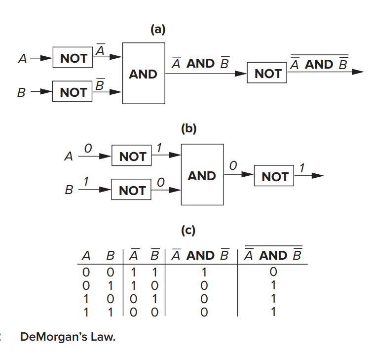

# Bits, Data Types and Operations

## Bits and Data Types

### A unit of information

We symbolically represent the precence of voltage as "1" and the absence as "0". Each "1" and "0" is a bit (binary digit).

With one wire we can represent only two things (0 or 1). For example if we use 8 bits (corresponding to the voltage on each of 8 wires) we can represent $2^8=256$ different things. In general with $k$ bits, we can distinguish at most $2^k$ distinct items.

### Data Types

Ways to represent a value. A particular representation is a _data type_ if there are operations in the computer that can operate on information that is encoded in that representation.

- Decimal -> 5 = 5
- Unary -> 5 = 11111
- Binary
- Floating point -> $621 = 6.21 * 10^2$

## Integer Data Types

### Unsigned Integers

Has no sign (plus or minus) associated with it. It just has a magnitude. We can represent unsigned integers as strings of binary digits.

**Example:**

Decimal notation: $329 = 3*10^2 + 2*10^1 + 9*10^0$

With 5 Binary digits (base is 2 instead of 10): $5 = 0*2^4 + 0*2^3 + 1*2^2 + 0*2^1 + 1*2^0$

With $k$ bits, we can represent in this positional notation exactly $2^k$ integers, ranging from $0$ to $2^k - 1$.

### Signed Integers

In all three signed data types the representation for 0 and positive integers start with a leading 0.

Below is a 5-bit table showing how the same 5-bit pattern is interpreted as an unsigned integer, signed-magnitude, 1's complement and 2's complement value.

| Representation | Unsigned | Signed Magnitude | 1's Complement | 2's Complement |
| -------------: | :------: | :--------------: | :------------: | :------------: |
|          00000 |    0     |        0         |       0        |       0        |
|          00001 |    1     |        1         |       1        |       1        |
|          00010 |    2     |        2         |       2        |       2        |
|          00011 |    3     |        3         |       3        |       3        |
|          00100 |    4     |        4         |       4        |       4        |
|          00101 |    5     |        5         |       5        |       5        |
|          00110 |    6     |        6         |       6        |       6        |
|          00111 |    7     |        7         |       7        |       7        |
|          01000 |    8     |        8         |       8        |       8        |
|          01001 |    9     |        9         |       9        |       9        |
|          01010 |    10    |        10        |       10       |       10       |
|          01011 |    11    |        11        |       11       |       11       |
|          01100 |    12    |        12        |       12       |       12       |
|          01101 |    13    |        13        |       13       |       13       |
|          01110 |    14    |        14        |       14       |       14       |
|          01111 |    15    |        15        |       15       |       15       |
|          10000 |    16    |        −0        |      −15       |      −16       |
|          10001 |    17    |        −1        |      −14       |      −15       |
|          10010 |    18    |        −2        |      −13       |      −14       |
|          10011 |    19    |        −3        |      −12       |      −13       |
|          10100 |    20    |        −4        |      −11       |      −12       |
|          10101 |    21    |        −5        |      −10       |      −11       |
|          10110 |    22    |        −6        |       −9       |      −10       |
|          10111 |    23    |        −7        |       −8       |       −9       |
|          11000 |    24    |        −8        |       −7       |       −8       |
|          11001 |    25    |        −9        |       −6       |       −7       |
|          11010 |    26    |       −10        |       −5       |       −6       |
|          11011 |    27    |       −11        |       −4       |       −5       |
|          11100 |    28    |       −12        |       −3       |       −4       |
|          11101 |    29    |       −13        |       −2       |       −3       |
|          11110 |    30    |       −14        |       −1       |       −2       |
|          11111 |    31    |       −15        |       −0       |       −1       |

2's complement data type is used on just about every computer manufactured today.

## 2's Complement Integers

The positive integers are represented with the regular positional scheme. With 5 bits, we use exactly half of the $2^5$ codes to represent $0$ and the positive integers from $1$ to $2^4 - 1$. The negative integers was based on the wish to keep the logic circuits as simple as possible. Almost all computers use the same basic mechanism to perform addition. It's called an _arithmetic and logic unit_, usually known by its acronym ALU.

ALU has two inputs and one output. It performs addition by adding the binary bit patterns at its inputs, producing a bit pattern at its output that is the sum of the two input patterns.

For example:

| Binary  |
| :-----: |
|  00110  |
|  00101  |
| ======= |
|  01011  |

Criterion: $A + (-A) = 0$

REPRESENTATION(value + 1) = REPRESENTATION(value) + REPRESENTATION(1)

To get the $-A$ from $A$: Flip all the bits of A, and add 1 to the complement of A. The sum of A and the complement of A is 11111. If we then add 00001 to 11111, the final result is 00000.

The final carry can be safely ignored in 2's complement.

## Conversion Between Binary and Decimal

Converting between 2's complement and decimal data types.

### Binary to decimal conversion

Assume 8-bit representation.

$b_7 b_6 b_5 b_4 b_3 b_2 b_1 b_0$

1.  If the leading bit $b_7$ is a 0, the integer is positive. If it is a 1, the integer is negative. In that case we, we need to obtain the 2's complement representation of the positive number having the same magnitude. We do this by flipping all the bits and adding 1.

2.  The magnitude is simply

        $b_6*2^6+b_5*2^5+b_4*2^4+b_3*2^3+b_2*2^2+b_1*2^1+b_0*2^0$

    In either case, we obtain the decimal magnitude by simply adding the powers of 2 that have coefficients of 1.

3.  Finally, if the original number is negative, we affix a minus sign in front.

### Decimal to Binary Conversion

- Obtain the binary magnitude of |N| by repeated parity checks: if the current value is odd the least-significant bit is 1, otherwise 0; subtract that bit and divide the value by 2; repeat to produce bits b0..b6.
- If N is non-negative, set the sign bit b7 = 0 and the 8-bit code is complete.
- If N is negative, form the 8-bit pattern for |N| (with b7 = 0), then negate it to get the two's-complement result (invert all bits and add 1).

Example: +105 -> magnitude bits produce `1101001` (b6..b0), prepend sign bit 0 => `01101001`.

### Extending Conversion to Numbers with Fractional Parts

This summary explains the methods for converting numbers that include a **fractional part** (i.e., digits to the right of the radix point) between binary and decimal.

---

#### ➡️ Binary to Decimal Conversion

The process for converting a binary fraction to its decimal equivalent is **straightforward** and based on the positional value of each bit.

- **Positional Value:** In a binary number like $0.b_{-1}b_{-2}b_{-3}b_{-4}$, the bits to the right of the binary point represent decreasing negative powers of 2.
  - $b_{-1}$ has a value of $2^{-1} = 0.5$.
  - $b_{-2}$ has a value of $2^{-2} = 0.25$.
  - $b_{-3}$ has a value of $2^{-3} = 0.125$.
  - $b_{-4}$ has a value of $2^{-4} = 0.0625$.
- **Method:** To convert, simply **sum the positional values** for every bit that is a **1**.
- **Example:** For the binary fraction **.1011**:
  $$0.5 + 0 + 0.125 + 0.0625 = \mathbf{0.6875}$$

---

#### ⬅️ Decimal to Binary Conversion

Converting a decimal fraction to binary is **more involved** and requires a repetitive multiplication process.

##### The Multiplication Method

To convert a decimal fraction, $D$, to its binary form, $0.b_{-1}b_{-2}b_{-3}...$, you repeatedly multiply the fractional part by **2** and take the resulting integer part as the next binary digit ($b_{-i}$).

$$D = b_{-1} \times 2^{-1} + b_{-2} \times 2^{-2} + b_{-3} \times 2^{-3} + \dots$$

1.  **Multiply by 2:** Multiply the decimal fraction by 2.
2.  **Determine the Bit ($b_{-i}$):**
    - If the result is **greater than or equal to 1**, the binary digit ($b_{-i}$) is **1**. Subtract 1 from the result, and use the new fractional part for the next step.
    - If the result is **less than 1**, the binary digit ($b_{-i}$) is **0**. Use the fractional part for the next step.
3.  **Repeat:** Continue this process until the fractional part is 0 or the desired number of bits is reached.

##### Example: Converting 0.421 to Binary

| Step | Operation        | Result  | Integer Part ($b_{-i}$) | New Fraction |
| :--- | :--------------- | :------ | :---------------------- | :----------- |
| 1    | $0.421 \times 2$ | $0.842$ | $\mathbf{0}$ ($b_{-1}$) | $0.842$      |
| 2    | $0.842 \times 2$ | $1.684$ | $\mathbf{1}$ ($b_{-2}$) | $0.684$      |
| 3    | $0.684 \times 2$ | $1.368$ | $\mathbf{1}$ ($b_{-3}$) | $0.368$      |
| 4    | $0.368 \times 2$ | $0.736$ | $\mathbf{0}$ ($b_{-4}$) | $0.736$      |

- **Result (4 bits):** $0.421_{10} \approx \mathbf{0.0110}_2$.

This process may continue **indefinitely** as not all decimal fractions have an exact, finite binary representation.

## Operations on Bits - Part 1: Arithmetic

Addition still proceeds from right to left, one digit at a time. Subtraction is addition preceded by determining the negative of the number to be subtracted.

### Sign-Extension

In the same way that leading 0s don't affect the value of a positive number, leading 1s do not affect the value of a negative number.

In order to add representations of different lengths, it's first necessary to represent them with the same number of bits.

### Overflow

What happens if the sum of two numbers can't be represented by the available bits?

The operation overflows and the result is incorrect.

## Operations on Bits - Part 2: Logical Operations

### Logical Variable

Logical operations operate on logical variables. It can have one of two values, 1 or 2.
The name comes from the fact that the two values 0 and 1 can represent the two logical values false and true.

### The AND Function

AND is a binary logical function. It requires two input data (source operands), each being a logical variable.

| A   | B   | AND |
| :-- | :-- | :-- |
| 0   | 0   | 0   |
| 0   | 1   | 0   |
| 1   | 0   | 0   |
| 1   | 1   | 1   |

We can apply the operation to two bit patterns of $m$ bits each. This involves applying the operation individually and independently to each pair of bits in the two source operands. That is called a _bit-wise AND_.

### The OR Function

| A   | B   | OR  |
| :-- | :-- | :-- |
| 0   | 0   | 0   |
| 0   | 1   | 1   |
| 1   | 0   | 1   |
| 1   | 1   | 1   |

### The NOT Function

NOT is a _unary_ logical function. That means it operates on only one source operand. It is also known as the _complement_ operation.

| A   | NOT |
| :-- | :-- |
| 0   | 1   |
| 1   | 0   |

### The Exclusive-OR Function

XOR is a binary logical function. The output is 1 if one of the source operands is 1 but not both.

| A   | B   | XOR |
| :-- | :-- | :-- |
| 0   | 0   | 0   |
| 0   | 1   | 1   |
| 1   | 0   | 1   |
| 1   | 1   | 0   |

### DeMorgan's Laws

DeMorgans First Law:

_"It is not the case that both A and B are false" is equivalent to saying "At least one of A and B is true"_

### The Bit Vector

An m-bit pattern where each bit has a logical value (0 or 1) independent of the other bits is called a _bit vector_.
