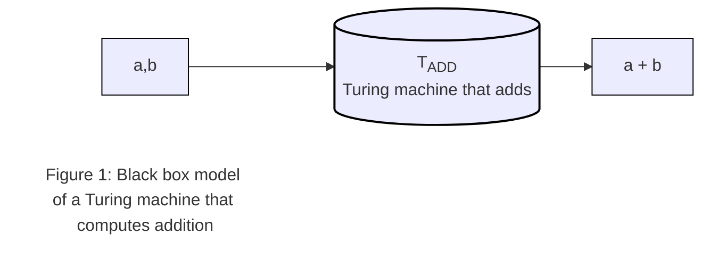
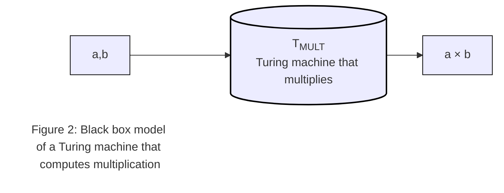
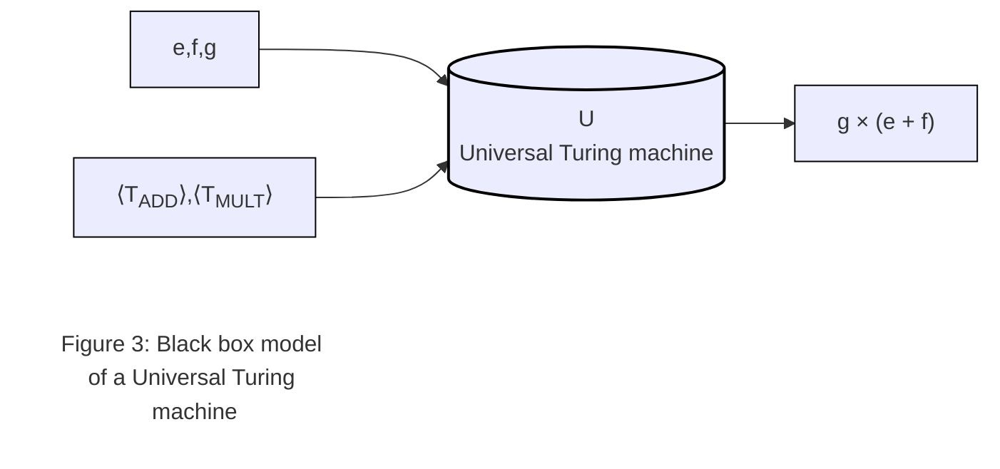

# Introduction

## Two important ideas

**Idea 1:** All computers are capable of computing the exact same things if they are given enough time and memory.

**Idea 2:** We describe problems in natural language but problems are solved inside the computer by running electrons. It is necessary to transform problems from the language of humans to the voltages that influence the flow of electrons.

## Universal computing devices - defining computation

A Turing machine is an abstraction of the actions performed by people when they compute, such as making marks on paper and writing symbols according to certain rules.

**Turing's thesis:** Every computation can be performed by some Turing machine. (Never been proved)

Model of a Turing machine that can simulate all Turing machines:

## Getting the electrons to work

The process of making the computer work are divided into steps called **Levels of Transformation**:

1. Problems
2. Algorithms
3. Language
4. Machine (ISA) Architecture
5. Microarchitecture
6. Circuits
7. Devices

### Problems

Natural languages result in ambiugity

### Algorithms

Natural language description -> Algorithm

**Algorithm:** Step by step procedure that is guaranteed to terminate (finiteness), such that each step is precisely stated (definiteness) and can be carried out by the computer (effective computability).

### The program

Algorithm -> Program

High level languages or low level languages

### The ISA (Instruction set architecture)

Program -> Instruction set of the particular computer

A complete specification of the interface between programs that have been written and the underlying computer hardware that must carry out the work.

**Opcode:** What operations (instructions) the computer can perform
**Operand:** Individual data values

The ISA specifies acceptable representations for operands - data types.

**Addressing modes:** The mechanisms that the computer can use to figure out where the operands are located.

The ISA also specifies the number of unique locations that comprise the computer's memory and the number of individual 0:s and 1:s that are contained in each location.

Translations between high level language to the ISA is done by the compiler (translating program)

### Microarchitecture

This is the implementation

### The logic circuit

Each element of the microarchitecture is implemented with logic circuits.

### Devices

Each basic logic circuit is implemented in accordance with the requirements of the particular device technology.
